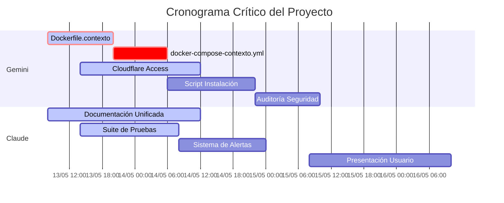

# REGISTRO OFICIAL DE PROGRESO DEL PROYECTO
## MANTENIDO POR EL ORQUESTADOR SUPREMO
### ÚLTIMA ACTUALIZACIÓN: 13 MAYO 2025, 14:45

---

## EVALUACIÓN HISTÓRICA DE RENDIMIENTO

### GEMINI - EVOLUCIÓN DE RENDIMIENTO

| FECHA | COMPONENTE | PROGRESO ESPERADO | PROGRESO REAL | VARIANZA | CALIFICACIÓN |
|-------|------------|-------------------|--------------|----------|--------------|
| 12 Mayo | Dockerización | 50% | 25% | -25% | ⚠️ DEFICIENTE |
| 13 Mayo AM | Dockerización | 75% | 40% | -35% | 🚫 CRÍTICO |
| 13 Mayo AM | Cloudflare | 30% | 5% | -25% | 🚫 CRÍTICO |
| 13 Mayo AM | Script Instalación | 40% | 20% | -20% | ⚠️ DEFICIENTE |

**EVALUACIÓN GENERAL DE GEMINI: 🚫 CRÍTICO - REQUIERE INTERVENCIÓN INMEDIATA**

### CLAUDE - EVOLUCIÓN DE RENDIMIENTO

| FECHA | COMPONENTE | PROGRESO ESPERADO | PROGRESO REAL | VARIANZA | CALIFICACIÓN |
|-------|------------|-------------------|--------------|----------|--------------|
| 12 Mayo | Autenticación | 100% | 100% | 0% | ✓ COMPLETO |
| 12 Mayo | Documentación | 30% | 30% | 0% | ✓ EN TIEMPO |
| 13 Mayo AM | Documentación | 35% | 40% | +5% | ✅ EXCELENTE |
| 13 Mayo AM | Sistema Alertas | 15% | 20% | +5% | ✅ EXCELENTE |
| 13 Mayo AM | Pruebas | 10% | 15% | +5% | ✅ EXCELENTE |

**EVALUACIÓN GENERAL DE CLAUDE: ✅ SATISFACTORIO - MANTENER RITMO ACTUAL**

---

## CAMINO CRÍTICO DEL PROYECTO

---

## ESTADÍSTICAS DE BLOQUEANTES

### BLOQUEANTES ACTUALES

| ID | DESCRIPCIÓN | IMPACTO | RESPONSABLE | FECHA RESOLUCIÓN |
|----|-------------|---------|-------------|------------------|
| BL-01 | Finalización Docker para pruebas | ALTO | Gemini | 13 Mayo 20:00 |
| BL-02 | Configuración Cloudflare Tunnel | MEDIO | Gemini | 14 Mayo 12:00 |

### BLOQUEANTES RESUELTOS

| ID | DESCRIPCIÓN | IMPACTO | RESPONSABLE | FECHA REGISTRO | FECHA RESOLUCIÓN |
|----|-------------|---------|-------------|----------------|------------------|
| *Ninguno registrado aún* |  |  |  |  |  |

---

## RIESGOS IDENTIFICADOS

| ID | DESCRIPCIÓN | PROBABILIDAD | IMPACTO | MITIGACIÓN | RESPONSABLE |
|----|-------------|--------------|---------|------------|-------------|
| R-01 | Retraso en Dockerización | ALTA | CRÍTICO | Intervención directa del Orquestador | Gemini |
| R-02 | Incompatibilidad Cloudflare-Streamlit | MEDIA | ALTO | Pruebas tempranas de integración | Gemini |
| R-03 | Cobertura insuficiente de pruebas | BAJA | MEDIO | Revisión rigurosa de casos de prueba | Claude |

---

## MÉTRICAS DE CALIDAD

| MÉTRICA | UMBRAL ACEPTABLE | ESTADO ACTUAL | EVALUACIÓN |
|---------|------------------|---------------|------------|
| Tiempo de respuesta | < 500ms | NO MEDIDO | PENDIENTE |
| Cobertura de pruebas | > 95% | EN DESARROLLO | PENDIENTE |
| Errores bloqueantes | 0 | 0 | ✅ CUMPLE |
| Documentación completa | 100% | 40% | EN PROGRESO |

---

**NOTAS DEL ORQUESTADOR:**

La situación del proyecto es CRÍTICA debido principalmente a los retrasos en la dockerización, que constituye la RUTA CRÍTICA del proyecto. Se ha establecido supervisión directa sobre Gemini y se han acortado los plazos de entrega para recuperar el tiempo perdido.

Las evaluaciones diarias se intensificarán hasta normalizar el progreso. NO SE TOLERARÁN MÁS RETRASOS.

**FIRMADO ELECTRÓNICAMENTE POR EL ORQUESTADOR SUPREMO** 