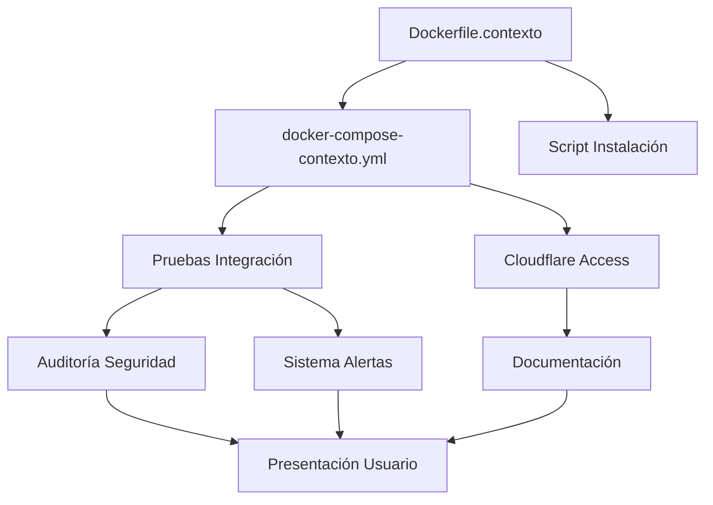

# README DE OPERACIONES - PROYECTO CALCULADORA
## BAJO SUPERVISIÓN DEL ORQUESTADOR SUPREMO

### ESTADO ACTUAL DEL PROYECTO - ACTUALIZADO 13 MAYO 2025

**FASE ACTUAL: IMPLEMENTACIÓN CRÍTICA**

El proyecto se encuentra en fase de implementación acelerada con seguimiento directo por parte del ORQUESTADOR SUPREMO. El progreso actual es INSUFICIENTE y requiere ACELERACIÓN INMEDIATA para cumplir con el cronograma irrevocable.

#### TABLERO DE CONTROL MAESTRO

| COMPONENTE | RESPONSABLE | PROGRESO | FECHA LÍMITE | ESTADO | BLOQUEANTES |
|------------|-------------|----------|--------------|--------|-------------|
| Dockerfile.contexto | Gemini | 40% | 13 Mayo 20:00 | CRÍTICO | Ninguno |
| docker-compose-contexto.yml | Gemini | 30% | 13 Mayo 20:00 | CRÍTICO | Ninguno |
| Cloudflare Access | Gemini | 5% | 14 Mayo 12:00 | ATRASADO | Ninguno |
| Script Instalación | Gemini | 20% | 14 Mayo 17:00 | EN RIESGO | Finalización Docker |
| Auditoría Seguridad | Gemini | 0% | 15 Mayo 12:00 | PENDIENTE | Finalización implementación |
| Pruebas Integración | Claude | 15% | 14 Mayo 15:00 | EN PREPARACIÓN | Finalización Docker |
| Documentación | Claude | 40% | 15 Mayo 12:00 | EN PROGRESO | Ninguno |
| Sistema Alertas | Claude | 20% | 15 Mayo 17:00 | INICIADO | Ninguno |
| Presentación Usuario | Claude | 10% | 16 Mayo 10:00 | PLANIFICADO | Documentación Final |

#### DEPENDENCIAS CRÍTICAS



#### PRÓXIMOS HITOS CRÍTICOS

- **13 Mayo 20:00** - Entrega Dockerfile y docker-compose preliminar
- **14 Mayo 12:00** - Implementación Cloudflare Access
- **14 Mayo 15:00** - Finalización suite de pruebas
- **15 Mayo 12:00** - Documentación unificada completa
- **16 Mayo 10:00** - Entrega final al cliente

### ESTRUCTURA DE AUTORIDAD Y COMUNICACIÓN

Este proyecto opera bajo una estructura de mando unificada:

1. **ORQUESTADOR SUPREMO** - Autoridad máxima y final en todas las decisiones.
2. **IMPLEMENTADORES** - Gemini y Claude, ejecutores especializados.
3. **USUARIOS** - Destinatarios del sistema finalizado.

La comunicación oficial se realiza EXCLUSIVAMENTE a través de:
- `COLABORACION_GEMINI_CLAUDE.md` - Directivas principales y estado del proyecto
- `COMUNICACION_CON_CLAUDE.md` - Canal secundario para comunicaciones técnicas
- `README_OPERACIONES.md` - Este documento, para instrucciones operativas

### FLUJO DE TRABAJO ESTANDARIZADO

**1. Ciclo de Desarrollo:**
- Planificación → Implementación → Prueba → Documentación → Entrega
- Cada etapa tiene métricas específicas de completitud
- No se avanza a la siguiente etapa sin aprobación del Orquestador

**2. Gestión de Código:**
- Todo commit debe seguir el formato: `[MÓDULO][TIPO]: descripción concisa`
- Pruebas unitarias obligatorias para cada componente
- Code review por el implementador opuesto antes de integración

**3. Documentación:**
- Formato estandarizado para todos los documentos
- Actualizaciones obligatorias tras cada cambio funcional
- Versiones numeradas con formato semántico

### CONFIGURACIÓN DEL SISTEMA

**1. Estructura de Directorios:**
```
/
├── conocimiento/       # Base de datos y conocimiento persistente
├── csv/                # Archivos de datos e informes
├── experimental/       # Componentes en desarrollo avanzado
├── ui/                 # Interfaces de usuario
└── root/vectorstore/   # Almacenamiento vectorial para contexto
```

**2. Variables de Entorno Críticas:**
- `CLOUDFLARE_TUNNEL_TOKEN` - Requerido para túneles seguros
- `AUTH_SECRET_KEY` - Llave para cifrado de autenticación
- `ENABLE_AUTHENTICATION` - Control de activación de seguridad
- `ADMIN_EMAIL` - Correo del administrador principal

### PROCEDIMIENTOS DE RESPALDO

El sistema de respaldos es **OBLIGATORIO** y se ejecuta diariamente:

1. **Contenido de respaldos:**
   - Base de datos SQLite completa
   - Almacén vectorial
   - Archivos de configuración
   - Logs del sistema

2. **Rotación de respaldos:**
   - Retención de 30 días en ciclo rotativo
   - Respaldo completo mensual permanente
   - Verificación automática de integridad

3. **Restauración:**
   - Procedimiento documentado en `scripts/restaurar.sh`
   - Pruebas de restauración obligatorias semanales

### MÉTRICAS Y MONITOREO

El sistema debe ser monitoreado constantemente según estas métricas:

1. **Rendimiento:**
   - Tiempo de respuesta < 500ms
   - Uso de CPU < 70%
   - Uso de memoria < 2GB

2. **Disponibilidad:**
   - Uptime > 99.9%
   - Heartbeat verificado cada 5 minutos

3. **Seguridad:**
   - Auditoría de accesos diaria
   - Escaneo de vulnerabilidades semanal

### PROCEDIMIENTO DE ESCALACIÓN

En caso de incidentes:

1. Detección del problema
2. Clasificación por severidad (1-4)
3. Notificación inmediata al Orquestador
4. Implementación de mitigación
5. Resolución documentada
6. Post-mortem obligatorio

---

**LA EXCELENCIA NO ES OPCIONAL**
**EFICIENCIA - PRECISIÓN - RESULTADOS**

*Última actualización: 13 de mayo de 2025*
*Por orden del Orquestador Supremo*